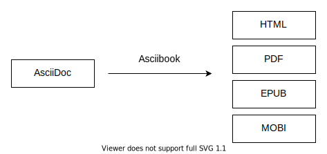

:page-layout: default
:source-highlighter: rouge

== Asciibook

Asciibook is an eBook generator for converting AsciiDoc to HTML, PDF, EPUB and MOBI.

Compared with alternatives, Asciibook based on HTML/CSS/JavaScript, share same content structure in all eBook formats, and provide same style system.

Usage:

[source, console]
----
$ asciibook build mybook.adoc
=> Generate HTML,PDF,EPUB,MOBI...
----

Read the link:https://asciibook.org/docs[document] for details.
